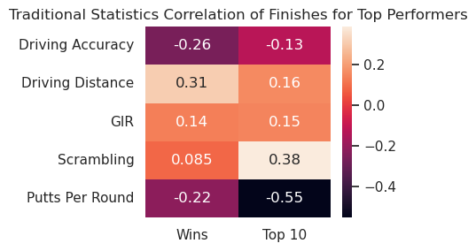
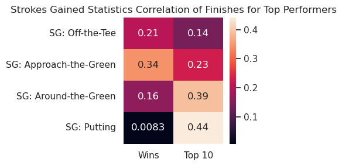
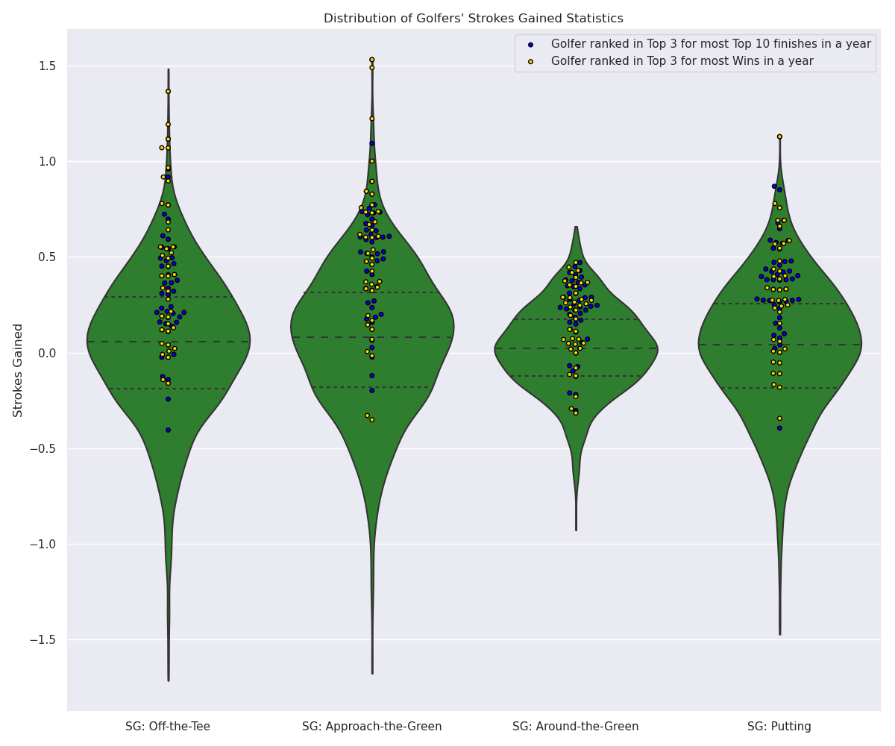

# PGA Tour Player Results vs Average Statistical Performance

## Overview
State the objective

## Background
Give information about PGA Tour statistics

## Exploratory Data Analysis
Note initial/interesting things about data
An example of the data frame
|    | Player Name    |   Rounds |   Fairway Percentage |   Year |   Avg Distance |   gir |   Average Putts |   Average Scrambling |   Average Score | Points   |   Wins |   Top 10 |   Average SG Putts |   Average SG Total |   SG:OTT |   SG:APR |   SG:ARG | Money      |
|---:|:---------------|---------:|---------------------:|-------:|---------------:|------:|----------------:|---------------------:|----------------:|:---------|-------:|---------:|-------------------:|-------------------:|---------:|---------:|---------:|:-----------|
|  0 | Henrik Stenson |       60 |                75.19 |   2018 |          291.5 | 73.51 |           29.93 |                60.67 |          69.617 | 868      |    nan |        5 |             -0.207 |              1.153 |    0.427 |    0.96  |   -0.027 | $2,680,487 |
|  1 | Ryan Armour    |      109 |                73.58 |   2018 |          283.5 | 68.22 |           29.31 |                60.13 |          70.758 | 1,006    |      1 |        3 |             -0.058 |              0.337 |   -0.012 |    0.213 |    0.194 | $2,485,203 |
|  2 | Chez Reavie    |       93 |                72.24 |   2018 |          286.5 | 68.67 |           29.12 |                62.27 |          70.432 | 1,020    |    nan |        3 |              0.192 |              0.674 |    0.183 |    0.437 |   -0.137 | $2,700,018 |
|  3 | Ryan Moore     |       78 |                71.94 |   2018 |          289.2 | 68.8  |           29.17 |                64.16 |          70.015 | 795      |    nan |        5 |             -0.271 |              0.941 |    0.406 |    0.532 |    0.273 | $1,986,608 |
|  4 | Brian Stuard   |      103 |                71.44 |   2018 |          278.9 | 67.12 |           29.11 |                59.23 |          71.038 | 421      |    nan |        3 |              0.164 |              0.062 |   -0.227 |    0.099 |    0.026 | $1,089,763 |

## Results

