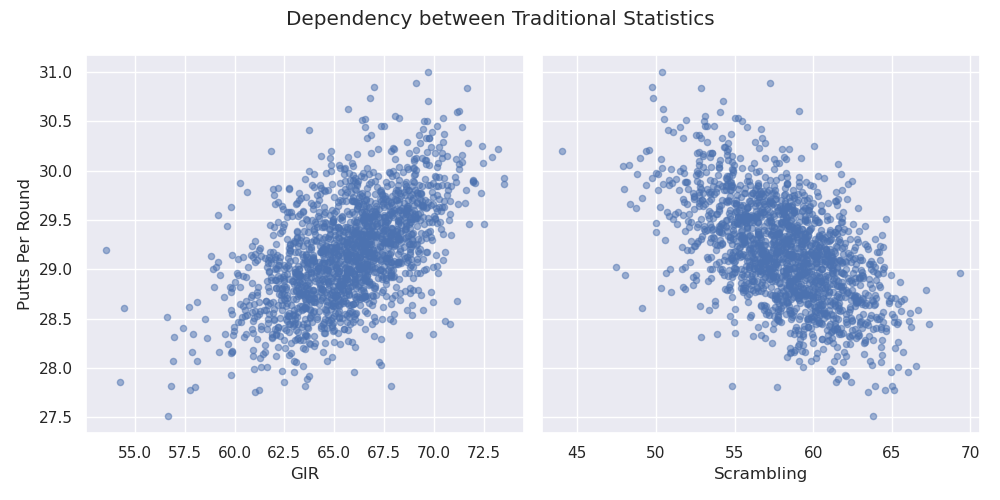

# PGA TOUR Player Results vs Average Statistical Performance

## Overview
There is an old golf adage that you "Drive for show and putt for dough." The idea behind it is that while hitting the ball a long ways is impressive, putting is more important to top finishes in tournaments. Despite this adage it seems like professional golfers are always trying to get more distance off the tee. So is this adage true? What is more important to winning, driving or putting? Or is somewhere between the tee and the green? The purpose of this anaysis is to investigate whether a single aspect of golf tends to lead to better tournament results.

## Background
### Golf in General
The goal in golf is to complete each hole in as few as strokes as possible. A golf round consists of 9 or 18 holes that each vary in length and difficulty and each hole is assigned a par number designating the expected number of strokes. 
There are four main aspects of golf: driving, approach the green, around the green, and putting. 
- A drive is the shot off the tee on par-4 or par-5 holes. 
- Approach shots are tee shots on par-3 holes and any shot on any hole that is farther than 30 yards from the green (excluding tee shots on par-4/5 holes). 
- Around the green shots are those taken within 30 yards of the green.
- Putting is any shot taken on the green. 

### The PGA TOUR
The PGA TOUR is the premier professional golf tour in North America. While it is based in the United States the best international golfers also participate in PGA TOUR events. Each tournament consists of four rounds which are typically played on Thursday through Sunday. Each round consists of 18 holes and the final tournament standings are based on who has the lowest total strokes after the final round. A full tournament will have 156 players to start. After two rounds there is a cut and only about 70 players with the lowets score to that point continue to play the weekend. 

### Tracked Statistics
The PGA TOUR tracks several statitics to indicate players performance and rate each aspect of their game. A complete list of all tracked stats can be found on the [PGA TOUR site](https://www.pgatour.com/stats.html).  I will review a few major statistical categories that will be used in this analysis. These can be divided into two groups, traditional and strokes gained. Traditional statistics have been used for decades while the strokes gained were introduced in 2011 for putting and 2016 for other aspects.
First lets review the traditional statistics. The table below gives a description of the 5 main statistics that most casual golfers are familiar with.

| Statistic Name | Description |
|---|---|
| **Driving Distance** | The average number of yards per measured drive. |
| **Driving Accuracy** | The percent of time that a tee shot comes to rest in the fairway. |
| **Greens in Regulation (GIR)** | The percent of time a player was able to hit the green in regulation   Note: A green is considered hit in regulation if any portion of the ball is touching the putting surface after the 1st stroke on a par 3, 2nd on a par 4, or 3rd on a par 5. |
| **Scrambling** | The percent of time a player misses the Green in Regulation, but still makes par or better. |
| **Putts per Round** | The average number of putts a player takes each round. |

The benefit of these traditional statistics are they are very straightforward and easy to calculate. A golfer at any skill level could track these for themselves durring a round. Where these statistics lack is the ability to isolate each aspect of golf to a single stat. This is due to the fact that each subsequent shot is dependent on the prior result. The figure below shows how the number of putts per round is related to both the GIR percentage and scrambling percentage. 

There is clearly a trend where the higher the GIR percentage the more average putts per round are taken. Intuitively this makes sense. A player who misses the green in regulation takes an extra shot to get on the green. That extra shot is usually taken closer around the green and hence has a higher probability of ending up closer to the hole than a player hitting the green in regulation.  

There is also shown in the figure that higher scrambling percentages correlate to lower putts per round. This too makes sense. In order to successfuly scramble for par on a hole the player must finish the hole in two shots after missing the GIR. This means they will at most have one put on a successful scramble (zero if they hole out from off the green).  

Consider how the GIR percentage could also be dependent on the Driving Distance and Driving Accuracy. Due to the dependant nature of these statistics it is difficult to make conclusions such as how good a player is at putting just based on the average putts per round. 

The strokes gained concept was developed by Professor Mark Broadie from Columbia University as a way to isolate each aspect of the game. I will give a breif overview of the concept but a more in depth description is on the [PGA TOUR strokes gained site](https://www.pgatour.com/news/2016/05/31/strokes-gained-defined.html). The strokes gained (SG) concept measures how well a player performs each shot based on the average tour player. The concept is made possible because of a ShotLink data that has been recorded since 2004.  There is a baseline for the average number of strokes it takes tour players to hole out from various distances based on where the shot is taken from (tee, fairway, rough, green, or other). The SG for each stroke has to do with what the expected number of strokes are from the current position and the expected number of strokes from where the shot ends up. There is a SG statistic for each of the four aspects of golf, they are listed in the table below.

| Name | Description |
|---|---|
| **SG: Off-the-Tee (SG:OTT)** | Measures performance off the tee on all par-4s and par5s. |
| **SG: Approach-the-Green (SG:APP)** | Measures performance on approach shots. |
| **SG: Around-the-Green (SG:ARG)** | Measures performance on any shot within 30 yards of the edge of the green |
| **SG: Putting** | Measures performance of strokes taken on the green. |

Because each individual stroke is measured against an established baseline, the SG statistics do not have the same dependent relationship that the traditional statistics have. An example of this is shown in the figure below where the SG: Approach-the-Green and SG: Around-the-Green are plotted with the SG: Putting. 

While the SG statistics align better with the objective off this analysis, I will continue to use the traditional statistics as well for two reasons. First, traditional statistics are more familiar to most people. The second reason is that this analysis could be extended to include years before SG statistics can be calculated which could provide some other useful insights. 

## Data Set Description
The data used for this analysis comes from a data set that was already built on Kaggle. The link for the data set is [PGA Tour Data](https://www.kaggle.com/jmpark746/pga-tour-data-2010-2018). The data was scraped from the [PGA TOUR site](https://www.pgatour.com/stats.html) and includes players' average annual statistics as well asfrom 2010-2018. Note that event though the SG statistics were not introduced for all aspects until 2016, the PGA TOUR had the data to go back and calculate the SG statistics to 2004.

A sample of how the data is formatted is given below. Each row is an individual players results for a specific year. The columns of interest include the traditional and strokes gained statistics listed in the tables above as well as the number of wins and number of top 10 finishes. There were NaNs in the data set instead of zeros when there weren't any wins or top 10s. 

|    | Player Name    |   Rounds |   Fairway Percentage |   Year |   Avg Distance |   gir |   Average Putts |   Average Scrambling |   Average Score | Points   |   Wins |   Top 10 |   Average SG Putts |   Average SG Total |   SG:OTT |   SG:APR |   SG:ARG | Money      |
|---:|:---------------|---------:|---------------------:|-------:|---------------:|------:|----------------:|---------------------:|----------------:|:---------|-------:|---------:|-------------------:|-------------------:|---------:|---------:|---------:|:-----------|
|  0 | Henrik Stenson |       60 |                75.19 |   2018 |          291.5 | 73.51 |           29.93 |                60.67 |          69.617 | 868      |    nan |        5 |             -0.207 |              1.153 |    0.427 |    0.96  |   -0.027 | $2,680,487 |
|  1 | Ryan Armour    |      109 |                73.58 |   2018 |          283.5 | 68.22 |           29.31 |                60.13 |          70.758 | 1,006    |      1 |        3 |             -0.058 |              0.337 |   -0.012 |    0.213 |    0.194 | $2,485,203 |
|  2 | Chez Reavie    |       93 |                72.24 |   2018 |          286.5 | 68.67 |           29.12 |                62.27 |          70.432 | 1,020    |    nan |        3 |              0.192 |              0.674 |    0.183 |    0.437 |   -0.137 | $2,700,018 |
|  3 | Ryan Moore     |       78 |                71.94 |   2018 |          289.2 | 68.8  |           29.17 |                64.16 |          70.015 | 795      |    nan |        5 |             -0.271 |              0.941 |    0.406 |    0.532 |    0.273 | $1,986,608 |
|  4 | Brian Stuard   |      103 |                71.44 |   2018 |          278.9 | 67.12 |           29.11 |                59.23 |          71.038 | 421      |    nan |        3 |              0.164 |              0.062 |   -0.227 |    0.099 |    0.026 | $1,089,763 |

 The data set included 2,312 rows which had 526 unique players over the 9 years. There were 157 players with at least one win and 391 players with at least one top 10. There were 78 players with more than one win over 9 years but only 29 who had more than one win in a single year. The most wins in a single year was 5 by Tiger Woods in 2013. The most top 10 finishes in a single year was 14 by Jordan Spieth in 2015. Over the 9 years Dustin Johnson had the most cumulative wins and top 10 finishes with 13 and 59 respectively.

## Analysis
One of the key downsides to this data set in regards to determining if one aspect of golf correlates to better results is that there are no 
* Rank
    - consider only top performers
* correlation map
* player distribution
* scatter plots

## Future Work