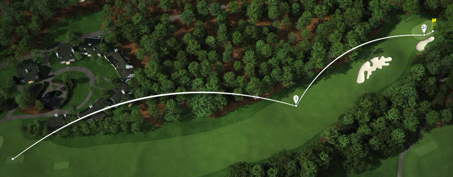
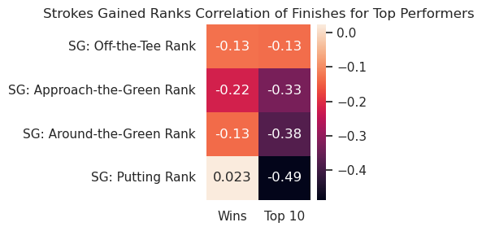
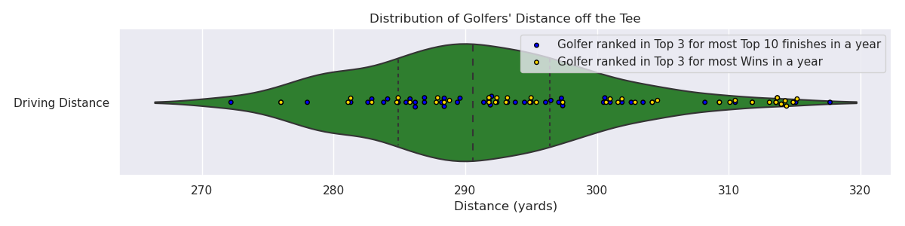

# PGA TOUR Player Results vs Average Statistical Performance

[Jump to Traditional Stats](#trad_stats_table)

## Overview

There is an old golf adage that you "Drive for show and putt for dough." The idea behind it is that while hitting the ball a long ways is impressive, putting is more important to top finishes in tournaments. Despite this adage it seems like professional golfers are always trying to get more distance off the tee. So is this adage true? What is more important to winning, driving or putting? Or is it somewhere between the tee and the green? The purpose of this analysis is to investigate whether a single aspect of golf tends to lead to better tournament results.

## Background
### Golf in General
The goal in golf is to complete each hole in as few as strokes as possible. A golf round consists of 9 or 18 holes that each vary in length and difficulty and each hole is assigned a par number designating the expected number of strokes. 
There are four main aspects of golf: driving, approach the green, around the green, and putting. 

- A drive is the shot off the tee on par-4 or par-5 holes. 
- Approach shots are tee shots on par-3 holes and any shot on any hole that is farther than 30 yards from the green (excluding tee shots on par-4/5 holes). 
- Around the green shots are those taken within 30 yards of the green.
- Putting is any shot taken on the green. 

### The PGA TOUR

The PGA TOUR is the premier professional golf tour in North America. While it is based in the United States the best international golfers also participate in PGA TOUR events. Each tournament consists of four rounds which are typically played on Thursday through Sunday. Each round consists of 18 holes and the final tournament standings are based on who has the lowest total strokes after the final round. A full tournament will have 156 players to start. After two rounds there is a cut and only about 70 players with the lowest score to that point continue to play the weekend. 

### Tracked Statistics
The PGA TOUR tracks several statistics to indicate players performance and rate each aspect of their game. A complete list of all tracked stats can be found on the [PGA TOUR site](https://www.pgatour.com/stats.html).  I will review a few major statistical categories that will be used in this analysis. These can be divided into two groups, traditional and strokes gained. Traditional statistics have been used for decades while the strokes gained were introduced in 2011 for putting and 2016 for other aspects.
First lets review the traditional statistics. The table below gives a description of the 5 main statistics that most casual golfers are familiar with.

###  Traditional Statistics 

| Statistic Name | Description |
|---|---|
| **Driving Distance** | The average number of yards per measured drive. |
| **Driving Accuracy** | The percent of time that a tee shot comes to rest in the fairway. |
| **Greens in Regulation (GIR)** | The percent of time a player was able to hit the green in regulation   Note: A green is considered hit in regulation if any portion of the ball is touching the putting surface after the 1st stroke on a par 3, 2nd on a par 4, or 3rd on a par 5. |
| **Scrambling** | The percent of time a player misses the Green in Regulation, but still makes par or better. |
| **Putts per Round** | The average number of putts a player takes each round. |

The benefit of these traditional statistics are they are very straightforward and easy to calculate. A golfer at any skill level could track these for themselves during a round. Where these statistics lack is the ability to isolate each aspect of golf to a single stat. This is due to the fact that each subsequent shot is dependent on the prior result. The figure below shows how the number of putts per round is related to both the GIR percentage and scrambling percentage. 

There is clearly a trend where the higher the GIR percentage the more average putts per round are taken. Intuitively this makes sense. A player who misses the green in regulation takes an extra shot to get on the green. That extra shot is usually taken closer around the green and hence has a higher probability of ending up closer to the hole than a player hitting the green in regulation.  

There is also shown in the figure that higher scrambling percentages correlate to lower putts per round. This too makes sense. In order to successfully scramble for par on a hole the player must finish the hole in two shots after missing the GIR. This means they will at most have one put on a successful scramble (zero if they hole out from off the green).  

Consider how the GIR percentage could also be dependent on the Driving Distance and Driving Accuracy. Due to the dependent nature of these statistics it is difficult to make conclusions such as how good a player is at putting just based on the average putts per round. 

The strokes gained concept was developed by Professor Mark Broadie from Columbia University as a way to isolate each aspect of the game. I will give a brief overview of the concept but a more in depth description is on the [PGA TOUR strokes gained site](https://www.pgatour.com/news/2016/05/31/strokes-gained-defined.html). The strokes gained (SG) concept measures how well a player performs each shot based on the average tour player. The concept is made possible because of a ShotLink data that has been recorded since 2004.  There is a baseline for the average number of strokes it takes tour players to hole out from various distances based on where the shot is taken from (tee, fairway, rough, green, or other). The SG for each stroke has to do with what the expected number of strokes are from the current position and the expected number of strokes from where the shot ends up. There is a SG statistic for each of the four aspects of golf, they are listed in the table below.

### Strokes Gained Statistics 

| Name | Description |
|---|---|
| **SG: Off-the-Tee (SG:OTT)** | Measures performance off the tee on all par-4s and par-5s. |
| **SG: Approach-the-Green (SG:APP)** | Measures performance on approach shots. |
| **SG: Around-the-Green (SG:ARG)** | Measures performance on any shot within 30 yards of the edge of the green |
| **SG: Putting** | Measures performance of strokes taken on the green. |

[Jump to Data](#data-set-description)

Because each individual stroke is measured against an established baseline, the SG statistics do not have the same dependent relationship that the traditional statistics have. An example of this is shown in the figure below where the SG: Approach-the-Green and SG: Around-the-Green are plotted with the SG: Putting. 

While the SG statistics align better with the objective off this analysis, I will continue to use the traditional statistics as well for two reasons. First, traditional statistics are more familiar to most people. The second reason is that this analysis could be extended to include years before SG statistics can be calculated which could provide some other useful insights. 

## Data Set Description 
The data used for this analysis comes from a data set that was already built on Kaggle. The link for the data set is [PGA Tour Data](https://www.kaggle.com/jmpark746/pga-tour-data-2010-2018). The data was scraped from the [PGA TOUR site](https://www.pgatour.com/stats.html) and includes players' average annual statistics from 2010-2018. Note that even though the SG statistics were not introduced for all aspects until 2016, the PGA TOUR had the data to go back and calculate the SG statistics to 2004.

A sample of how the data is formatted is given below. Each row is an individual players results for a specific year. The columns of interest include the traditional and strokes gained statistics listed in the tables above as well as the number of wins and number of top 10 finishes. There were NaNs in the data set instead of zeros when there weren't any wins or top 10s. 

|    | Player Name    |   Rounds |   Fairway Percentage |   Year |   Avg Distance |   gir |   Average Putts |   Average Scrambling |   Average Score | Points   |   Wins |   Top 10 |   Average SG Putts |   Average SG Total |   SG:OTT |   SG:APR |   SG:ARG | Money      |
|---:|:---------------|---------:|---------------------:|-------:|---------------:|------:|----------------:|---------------------:|----------------:|:---------|-------:|---------:|-------------------:|-------------------:|---------:|---------:|---------:|:-----------|
|  0 | Henrik Stenson |       60 |                75.19 |   2018 |          291.5 | 73.51 |           29.93 |                60.67 |          69.617 | 868      |    nan |        5 |             -0.207 |              1.153 |    0.427 |    0.96  |   -0.027 | $2,680,487 |
|  1 | Ryan Armour    |      109 |                73.58 |   2018 |          283.5 | 68.22 |           29.31 |                60.13 |          70.758 | 1,006    |      1 |        3 |             -0.058 |              0.337 |   -0.012 |    0.213 |    0.194 | $2,485,203 |
|  2 | Chez Reavie    |       93 |                72.24 |   2018 |          286.5 | 68.67 |           29.12 |                62.27 |          70.432 | 1,020    |    nan |        3 |              0.192 |              0.674 |    0.183 |    0.437 |   -0.137 | $2,700,018 |
|  3 | Ryan Moore     |       78 |                71.94 |   2018 |          289.2 | 68.8  |           29.17 |                64.16 |          70.015 | 795      |    nan |        5 |             -0.271 |              0.941 |    0.406 |    0.532 |    0.273 | $1,986,608 |
|  4 | Brian Stuard   |      103 |                71.44 |   2018 |          278.9 | 67.12 |           29.11 |                59.23 |          71.038 | 421      |    nan |        3 |              0.164 |              0.062 |   -0.227 |    0.099 |    0.026 | $1,089,763 |

[Jump to Correlation](#correlation-of-results-to-rankings)

 The data set included 2,312 rows which had 526 unique players over the 9 years. There were 157 players with at least one win and 391 players with at least one top 10. There were 78 players with more than one win over 9 years but only 29 who had more than one win in a single year. The most wins in a single year was 5 by Tiger Woods in 2013. The most top 10 finishes in a single year was 14 by Jordan Spieth in 2015. Over the 9 years Dustin Johnson had the most cumulative wins with 13 and and Matt Kuchar had the most cumulative top 10 finishes with 66.

## Analysis
### Defining Top Performers
Wins on the PGA TOUR can be very few and far between for the majority of players. As I began to investigate the data I considered this and was concerned that a player could have performed much better than usual one week and got a win or top 10. Because the statistics in the data are based on the yearly averages that meant players who perform much worse on average could still have a top finish. Without knowing the individual tournament results and statistics including these one-off type wins would make correlation difficult. To work around this I decided to make a distinction for the top performers. I defined the top performers as the players who were ranked in the top 3 for either the most wins or the most top 10s for a given year. There were always at least three players with multiple wins so no single win player would be considered unless they were consistently in the top 10. The top performers did include players without any wins because they ranked in top 3 for top 10 finishes.

I will break down how this worked for 2010. In 2010 there were five players tied for the most wins, which was only two. All five of these players would be considered top performers. For top 10 finishes there was one player with 9, one player with 8, and then 11 players tied with 6. Three of the players with 6 top 10 finishes were players with two wins, so there were 15 players I considered top performers that year. This was the most for any year considered. 

The total number of top performer data points for all years was 73, which were from 42 unique players. However, the average statistics were missing for one player, Rory McIlroy, in 2015 so the actual number of top performer data points used for analysis was 72.

### Correlation of Results to Rankings
Instead of comparing the correlation of actual statistics to the tournament results I decided to rank each player in each statistic first. The reason for this is because the exact value for the statistical category is less important than what the value is compared to other players. Certain tournaments provide different challenges to players and the entire field averages' fluctuate as a result. As long as players are performing better than their peers, they should be seeing better results. 

The two figure below shows the correlation between the number of wins and top 10 finishes each year and where the players ranked in statistical categories. The first figure is for the traditional statistics and the second is for the strokes gained statistics. Note that because the correlation is to rank values (1st, 2nd, 3rd, etc.), a higher negative correlation is better. 

For the traditional statistics the driving distance and GIR have the highest correlation to wins but putts per round is significantly higher than the rest for top 10 finishes. Driving accuracy seems the least important and distance doesn't seem to matter for top 10 finishes.

[Jump to Distributions](#player-statistical-distributions)

For the strokes gained statistics approach-the-green has the highest correlation with wins and putting has the lowest (nearly zero). For top 10s putting has the highest correlation and off-the-tee (driving) has the lowest.

It surprised me that there is not more consistency between the number of wins and top 10 finishes for either statistic type (traditional or SG). One great example is that putting has the highest correlation for top 10 finishes for both statistic types, but the correlation to wins drops significantly. Because of this I am not sure what to make of the old adage. When considering only wins it appears that adage is not true. However, winning isn't the only way to make 'dough'. Golfers in the top 10 still get paid well and a golfer consistently finishing in the top 10, despite never winning, can make more money than a golfer that wins a couple times but doesn't finish as well in other tournaments. So perhaps the adage is still true.

### Player Statistical Distributions
To get a better idea of how the top performers' statistics compared to the rest of the field I created violin plots to show the distribution for each statistical category for all players and overlaid points representing the top performers. The first one below is for the average driving distance. The green region is the distribution of the average driving distance for all players every year. It resembles a normal distribution, as do the others that will be shown subsequently. The quartiles (25%, median, 75%) are indicated by the dashed lines. Players ranked in the top 3 for the most top 10s or wins in a given year are marked with blue and gold circles, respectively. Note that more statistical rigor could, and should be applied to this analysis, but a quick visual check will suffice for the time being. The distribution of the top performer markers appears relatively even, except for a group of top 3 wins around the 314 yard region. This indicates that players are not more likely to perform better just due to driving distance. Thinking back to the correlation maps the distance was one of the highest correlations for wins. The top 3 wins grouping just mentioned is likely the cause for that higher correlation.

The following two figures show the rest of the traditional statistics. The first has the driving accuracy, GIR, and scrambling, which are all measured by percentage. The second is the average putts per round. To give an idea of what the change in percentage means for driving accuracy, there are typically 14 holes per round used for this measurement (all par-4 and par-5 holes). Hitting 8 out of the 14 fairways results in 57.1% accuracy, and hitting 9 out of 14 is 64.3%. Around 50% of PGA TOUR players are only separated by an average of one hit fairway per round. The distribution of GIR is even tighter. The mean is 65.7% with a standard deviation of 2.7%.  So 95% of the players in the data set have a GIR percentage between 60.3-71.1%. In an 18 hole round that is 10.9-12.8 greens hit. 

The distribution of the top performers is mostly even for driving distance and accuracy but skewed towards one end for GIR, scrambling, and putts per round. This indicates players consistently finishing high in tournaments are typically above average in those three categories, but not more likely to be above average in driving the ball. This tends to support the notion that players do "Drive for show and putt for dough."

[Jump to SG](#sg_violin)

That being said, I already made the case that traditional statistics are not the best indicators of performance in individual aspects of the game. Consider instead the figure below, which is the same type of plots but for the strokes gained statistics. Notice that for these the median values are all close to zero. This is to be expected due to the nature of comparing the player's strokes gained to the field. The distribution of the top performers in this figure tells a different story about driving the ball. Here the majority of top performers are above average with respect to strokes gained off-the-tee. So maybe driving isn't just for show? Due to the lack of an obvious trend in one aspect over another I will refrain from making any conclusions on the most important aspect until a more in depth statistical analysis is made. I will say (again) that the strokes gained method should be used over the traditional statistics for that analysis.

[Jump to Player Overview](#top-player-overview)

### Top Player Overview

To try and get a little more insight I looked at a couple of the top players over the nine year span. Dustin Johnson had 13 wins (the most during that time) and 64 top 10 finishes.  Matt Kuchar had  4 wins and 66 top 10 finishes (the most during that time). Kuchar was also on the my defined top performer list 6 out of the 9 years, two more times than any other golfer. The figures below show the strokes gained averages for each aspect each year, and below it the number of wins and top 10 finishes the player had that year.  Johnson is known as big hitter and the stats clearly show that is the strength of his game. There was only one year where he gained more strokes on average than off-the-tee. The only year he didn't win was his worst year putting, but despite this he still managed 5 top 10s. Overall Dustin Johnson is evidence that driving the ball well can be the key to success. 

Matt Kuchar is a great player to contrast with Dustin Johnson. Kuchar's weakest part of the game, with respect to strokes gained, is most often off-the-tee. That being said, he was not losing strokes (until 2018) so he was still driving the ball better than the average TOUR player. Kuchar typically gained the most strokes from approach shots and putting. Comparing these two individuals shows that there isn't just one way to play the game to be successful. 

## Conclusions/Future Work

After investigating the PGA TOUR data, I have concluded that the old golf adage "You drive for show and putt for dough" is true, except when it is not. In other words, sometimes it is true but it is definitely not always true. It is important to remember the distinction I made for top performers. Altering this definition is one aspect that could be investigated in the future. What if only the top rank for wins and top 10s was considered? Or the top 5? Or anyone with a win or top ten? 

There are several other possible continuation for this work. The most important of which, in my opinion, would be to apply the analysis to  the individual tournament level. Comparing the individual tournament results to where each player finished in each statistical category that week would provide more reliable correlations. Because many of the tournaments are held at the same place each year there could be information gained about specific skills that suit each course. 

The data set could also be expanded to include all strokes gained data available (from 2004 to the present). Each aspect of the game could also be compared quantitatively to better understand trends in tournament finishes. Even with the current data set more could be explored with regards to each strokes gained statistic such as which attribute did winners rank the highest in most often? 

For the traditional statistics data could be gathered for a much longer time period to give decades worth of statistics. It would be interesting to see if there were any trends that changed over time, or to investigate if "Drive for show, putt for dough" was really true decades ago when the phrase first started circulating. 